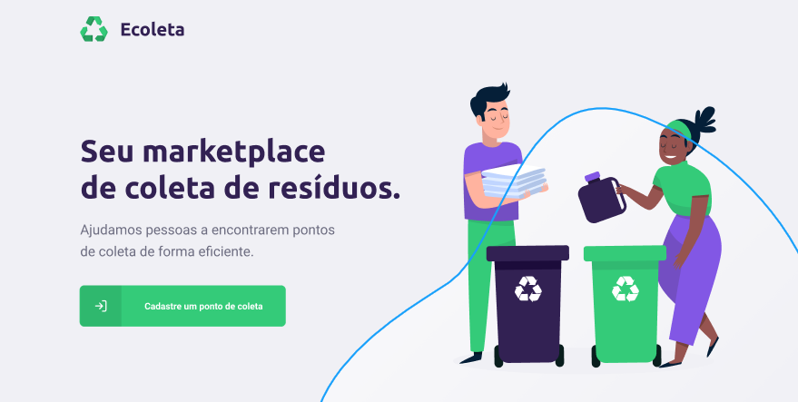

<!-- Logo -->

<h6 align="center">
  
</h6>

<!-- Badges -->

<p align="center">
  
  <br/>
</p>

<!-- Description -->

<h3 align="center"> 
	🚀 Seu marketplace de coleta de resíduos! ♻️
</h3>


<!-- Project Design -->

<p align="center">
  
<p>

<!-- Summary -->

# Índice

- [Sobre](#sobre)
- [Tecnologias](#tecnologias)
- [Como usar](#como-usar)
- [Como contribuir](#como-contribuir)
- [Licença](#licenca)

<a id="sobre"></a>

## :bookmark: Sobre

O Ecoleta trata-se de uma aplicação Web/Mobile que funciona como um marketplace para coleta de resíduos, onde os usuários podem tanto descobrirem onde há pontos de coleta próximos quanto informar onde há um ponto de coleta. 

Essa aplicação foi realizada durante a **Next Level Week #1**, mais um projeto da [Rocketseat](https://rocketseat.com.br/).

<a id="tecnologias"></a>

## :rocket: Tecnologias

Essa aplicação se utiliza das seguintes tecnologias:

-  [TypeScript](https://www.typescriptlang.org/)
-  [NodeJS](https://nodejs.org/en/)
-  [ReactJS](https://reactjs.org/)
-  [React Native](http://facebook.github.io/react-native/)
-  [Expo](https://expo.io/)

<a id="como-usar"></a>

## :information_source: Como usar

Para executar esta aplicação é necessário que você possua em sua máquina as seguintes dependências:
- [NodeJS](https://nodejs.org/en/download/)
- [Yarn](https://classic.yarnpkg.com/en/docs/install/)
- [Expo](https://docs.expo.io/get-started/installation/)

Feito a instalação,
```sh
# Clone o repositório
$ git clone https://github.com/igooralm192/ecoleta

# Mova para a pasta raiz do projeto
$ cd ecoleta
```

E siga os seguintes passos para executar a aplicação:
#### Back-end
```sh
# Mova para a pasta backend
$ cd backend

# Instale as dependências do projeto
$ npm install

# Execute as migrations e seeds
$ npm run knex:migrate
$ npm run knex:seed

# Execute o backend no modo dev
$ npm run dev
```

#### Front-end
```sh
# Mova para a pasta frontend
$ cd frontend

# Instale as dependências do projeto
$ npm install

# Execute o frontend
$ npm start
```

#### Mobile
```sh
# Mova para a pasta mobile
$ cd mobile

# Instale as dependências do projeto
$ npm install

# Execute o app
$ npm start
```

<a id="como-contribuir"></a>

## :recycle: Como contribuir

- Crie um fork desse repositório,
- Crie uma branch com o nome da sua feature: `git checkout -b my-feature`
- Faça um commit das suas alterações: `git commit -m 'feat: My new feature'`
- Faça um push da sua branch: `git push origin my-feature`


<a id="licenca"></a>

## :memo: Licença

Esse projeto está sob a licença MIT. Veja o arquivo [LICENSE](LICENSE.md) para mais detalhes.

---
<p align="center">
  Feito com ❤️ por <strong>IguzinhoTV</strong>!!
</p>
